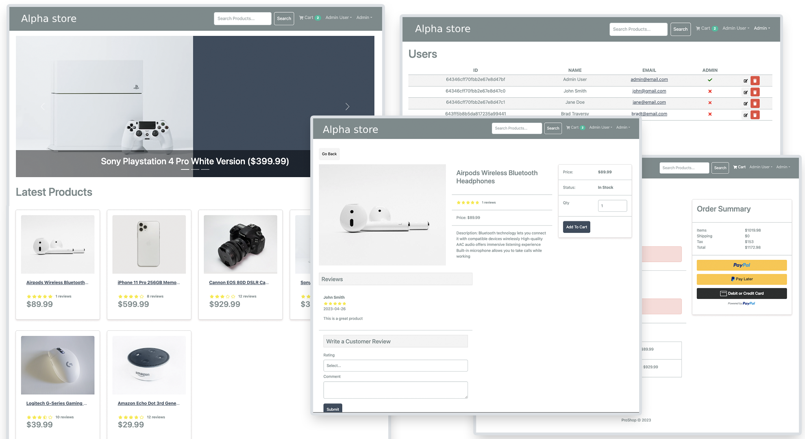

# Alpha Store eCommerce Platform

An eCommerce platform built with the MERN stack (React, Node, Express and Mongo Database) & Redux.
It is a full-featured shopping cart with PayPal & credit/debit payments.


This project is an application of  [MERN Stack From Scratch](https://www.traversymedia.com/mern-stack-from-scratch) course. 

Live : [alpha-store-tepv.onrender.com](https://alpha-store-tepv.onrender.com)


## Features

- Full featured shopping cart
- Product reviews and ratings
- Top products carousel
- Product pagination
- Product search feature
- User profile with orders
- Admin product management
- Admin user management
- Admin Order details page
- Mark orders as delivered option
- Checkout process (shipping, payment method, etc)
- PayPal / credit card integration
- Database seeder (products & users)

## Usage

- Create a MongoDB database and obtain your `MongoDB URI` - [MongoDB Atlas](https://www.mongodb.com/cloud/atlas/register)
- Create a PayPal account and obtain your `Client ID` - [PayPal Developer](https://developer.paypal.com/)

### Env Variables

Rename the `.env.example` file to `.env` and add the following

```
NODE_ENV = development
PORT = 5000
MONGO_URI = your mongodb uri
JWT_SECRET = 'abc123'
PAYPAL_CLIENT_ID = your paypal client id
PAGINATION_LIMIT = 8
```

Change the JWT_SECRET and PAGINATION_LIMIT to what you want

### Install Dependencies (frontend & backend)

```
npm install
cd frontend
npm install
```

### Run

```

# Run frontend (:3000) & backend (:5000)
npm run dev

# Run backend only
npm run server
```

## Build & Deploy

```
# Create frontend prod build
cd frontend
npm run build
```

### Seed Database

You can use the following commands to seed the database with some sample users and products as well as destroy all data

```
# Import data
npm run data:import

# Destroy data
npm run data:destroy
```


*Admin Login*
Email: `admin@email.com`
Password: `123456`

*Sample User Login*
Email: `john@email.com`
Password: `123456`

*Paypal sand box account for testing*
Email: `sb-np3sb13445127@personal.example.com`
Password: `g@^=C&?1`
